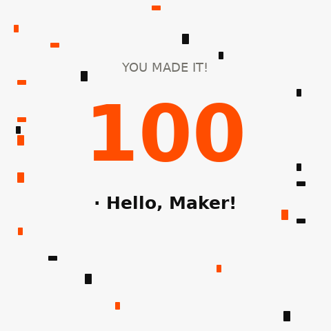
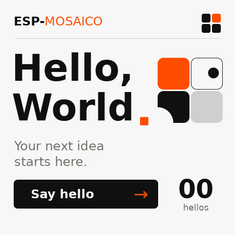

# Hello World 实现与验证

已按确认的概念图将唯一的 Hello World 应用统一到
[`projects/hello_world`](../../../projects/hello_world/README.md)。旧 LVGL Hello World
由 GSP 实现替换，独立 `projects/gsp_hello` 目录已移除。

## 原生渲染

以下为 ESP-GSP 1.2.0 模拟器实际运行共享 C 后端得到的 480×480 RGB565 截图，
不是概念图或网页重绘。使用原生文字、容器、按钮和文本绑定；字体为随工程附带并保留
许可证的 DejaVu Sans regular/bold。

点击 Say hello 的文字或箭头均增加计数，长按只计一次，点击按钮外不改变计数。
第 100 次点击显示「100 · Hello, Maker!」与橙黑彩纸动画，约 3 秒后回到 00；
庆祝期间忽略额外点击，重新启动重置。底部说明文字已移除。
按钮圆角统一为 8 px，与 GSP 1.2.0 固定的按压高亮圆角一致，避免高亮溢出。计数仅用于展示触摸交互，不代表系统负载。

## 工程迁移

- 保留独立 `ui_apps` 资源分区、Recovery 固定分区前缀和 ESP-Iris 屏幕镜像。
- 更新默认模拟器入口、项目生成描述、测试固件引用、文档和 CI；删除重复的固件 CI 任务。
- 项目生成器复制 22 个源文件与资源，包含 PC 后端、场景和字体，并重定位 GSP 编译器与
  资源打包器路径。验证了嵌套目录下的新建工程。
- 固定 ESP-GSP 1.2.0；应用维持 ESP-IDF >=6.2 的约束。

## 验证结果

- 原生 C 后端交互测试通过：101 次问候，覆盖文字点击、箭头点击、按钮外点击、长按、
  按钮按压边角、百次彩蛋、彩纸帧变化、庆祝期间忽略点击、自动归零和正常关闭。测试入口：
  [`tests/hello_world_ui/run.py`](../../../tests/hello_world_ui/run.py)。
- 相关回归测试：33 passed、29 subtests passed；最终模板文档调整后再次运行生成器测试，7 passed。
- Hello World 固件构建通过，零警告：ESP32-S31。
- 由模板生成的嵌套 `init_smoke` 工程完整构建通过，零警告。
- 使用本机 ESP-IDF `v6.2-dev-2221-g7b9cc1ac79f-dirty`、Python 3.12.3；保留环境原有修改。

设备烧录已完成，见下方设备验证记录。触摸手感仍由用户在实体屏幕上体验。
从旧 LVGL 固件迁移时应执行 `python mosaico.py iris system-update --project projects/hello_world`，
同时安装应用、分区表与 `ui_apps`；不能仅使用 app-update 更新这次 UI 资源。

## 本地完整证据

- [Hello World 构建原始日志](../../../projects/hello_world/.codex-runs/idf-low-noise-build/20260919-215143-build-1157578/raw.log)
- [生成工程构建原始日志](../../../tests/firmware/build-hello-world-template/init_smoke/.codex-runs/idf-low-noise-build/20260919-211943-build-1126853/raw.log)
- [原生交互结果](../../../.agents/validation/hello-world-migration/build-refinement/celebration/result.json)
- [原生后端日志](../../../.agents/validation/hello-world-migration/build-refinement/celebration/backend.log)

这些构建与运行证据保留在本地忽略目录；本页 PNG 是可随源码保留的渲染证据。

## 设备验证（2026-09-19）

已通过 `mosaico.py iris system-update` 安装到 USB `1-1` 上的设备：

- MAC：`30:ed:a0:f4:51:8e`。
- Device ID：`4553502d49524953010030eda0f4518e`。
- 更新操作：`daa45966-91bc-42f6-bea0-f338b1e1ad31`，状态 succeeded、validated、healthy。
- 同一设备 normal→Recovery→normal 的 Boot ID：
  `1948257783875663994` → `1653815596140587364` → `6627965944312267903`。
- 固件 ELF SHA-256：`a9d28868f9a50464902a44d5cbdfb0cad9533bc8604391f0d6242058872e0ceb`，与设备一致。
- UI 资源 SHA-256：`a4ab24e0a8409015c1a3b170d380d14ed85bb02ad45cd831dd8dab78200f8313`。
- 首次设备截图暴露出模拟器与设备对子容器裁剪行为的差异。装饰圆改为根级图形，
  并将标题橙色方块绘制在其上方，消除遮挡；修正后重新通过 101 次原生交互测试及设备 System Update。
- 本轮细化已重新烧录：首页与原生模拟器逐像素一致；百次彩蛋、动画和计时恢复已通过
  原生共享 C 后端测试。实体屏幕的百次触摸体验仍由用户验证。
- CLI 与工作台使用的 Gateway API 返回相同 Device ID、Boot ID 和更新操作记录。
- 另一台 USB 设备未被认领或更新。产品命令已自动保留操作前可用的历史 core dump。

[设备验证结构化结果](../../../.agents/validation/hello-world-migration/build-refinement/summary.json) ·
[完整更新操作](../../../.agents/validation/hello-world-migration/build-refinement/system-update-operation.json) ·
[设备原始日志](../../../.agents/validation/hello-world-migration/build-refinement/device-logs.txt)
