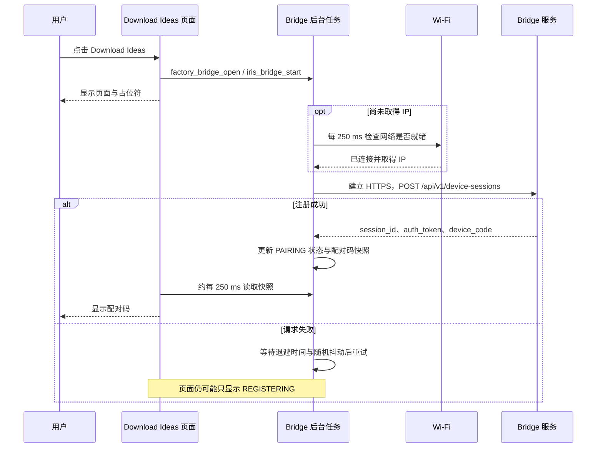

# Download Ideas 配对码显示延迟分析报告

日期：2026-09-20。范围：当前 Recovery 固件源码、已有日志、在线设备只读状态；未修改固件、重新注册会话、刷机或触发下载。

本文保留改进前的分析结论。后续已实现后台预取配对码与 GSP 无损压缩，实际行为、容量及验证结果见[实施验证报告](download-ideas-prefetch-validation.zh-CN.md)。

**结论：配对码由 Bridge 服务在设备注册成功后返回，点击 Download Ideas 才开始注册，所以联网、建立 HTTPS 连接及服务端响应时间都会直接成为用户等待时间。UI 另有约 0–250 ms 的轮询等待。若注册失败，当前重试策略会额外引入 10–11 秒、20–21 秒、40–41 秒等等待，并缺少清晰提示。**

这些机制已由代码确认。但本次未捕获用户点击到首次出码的完整时序，因此不能断言此次延迟主要来自 TLS、服务端或重试，也不能给出已验证的优化收益。

## 1. 证据与适用范围

| 项目 | 本次结果 |
| --- | --- |
| 源码版本 | `esp-mosaico-utils`：`d941b872de70fdbf858b2215e6c68f56cf87371a`，检查时子模块工作区干净 |
| 在线 Device ID | `4553502d49524953010030eda0f4518e`，通过 `mosaico.py iris list` 实时发现 |
| Boot ID | `2333090804097818416` |
| 固件 | Recovery `0.1`，固件 SHA-256 与当前 GSP 1.4 预置包说明一致：`115c82f0169080e003963b91da961e69d142eacf1980b1e7d89efb0c8c3da083` |
| 网络状态 RPC | `connected=true`，`error=0` |
| Bridge 状态 RPC | `PAIRING`，`running=true`，已有配对码，剩余约 370 秒，`error=0` |
| 证据限制 | 状态读取发生在配对码生成之后，不能还原此前重试次数及各阶段耗时；`error=0` 也不证明此前没有失败 |

读取使用工作区 `mosaico.py` 和现有 Gateway，未直接占用 USB。原始日志和 RPC 响应保存于 `.agents/analysis/download-ideas-20260920/`；`summary.json` 不包含配对码正文。日志包含历史启动记录，不应全部归入当前 Boot ID。

## 2. 从点击到显示，实际发生了什么

没有保存 Wi-Fi 凭据且未联网时，会先进入 Wi-Fi 设置页；完成连接后再进入上述注册流程。有凭据不代表当前已经联网，UI 允许这种情况下直接进入下载页等待。

首次成功时可按下式拆分：

`出码耗时 = 点击处理/任务启动 + 剩余联网时间 + 网络检查等待 + DNS/TCP/TLS + 注册响应/解析 + UI 轮询等待 + 实际绘制`

发生失败时，再加上每次失败请求耗时及其退避等待。DNS 是否命中缓存、TLS 和服务端耗时均需要实际测量。

关键代码位置：

| 环节 | 源码位置 |
| --- | --- |
| 点击、进入页面 | `main/vibe_ui.c:68`、`:141` |
| Bridge 配置及网络就绪判断 | `main/factory_bridge.c:7`、`:14` |
| 等待网络、注册、保存返回码 | `components/iris_bridge/iris_bridge.c:803` |
| HTTPS 请求与响应读取 | `components/iris_bridge/iris_bridge.c:151`、`:195` |
| 展示配对码与周期刷新 | `main/vibe_ui.c:263`、`:278` |

以上路径均相对于 `submodule/esp-mosaico-utils/esp-mosaico-recovery/firmware/recovery/`。

## 3. 已确认的等待来源

### 3.1 点击后才开始注册：正常路径也需要等待远端

`factory_bridge_open()` 才启动 Bridge 任务，任务随后执行注册 POST。`device_code` 来自该响应，响应前显示 `----------` 是当前数据依赖导致的行为。

`identity()` 只构造少量设备身份字段。完整 inventory 在后续轮询发现 `inventory_required` 后才执行，因此首次出码不需要等待完整分区清单或镜像散列计算。当前代码也没有显式等待 SNTP 的步骤。

**影响：** 即便 Wi-Fi 已连接，也不会直接显示新码。具体有多少秒耗在 DNS、TLS 或服务端，本次没有分段计时证据。

### 3.2 冷启动可能叠加 Wi-Fi 连接和 DHCP 时间

`main/main.c:43` 先启动 UI，`:71` 再启动网络。`factory_network_start()` 会读取保存的凭据并自动连接，但页面可见不等于网络就绪。Bridge 的就绪条件是 `CONNECTED` 且已有 IP。

保留日志中一个连续启动片段显示：UI 就绪时间戳为 `2992 ms`，Wi-Fi 取得 IP 为 `7022 ms`，相隔 **4.03 秒**。另一个片段中固件就绪为 `3140 ms`，取得 IP 为 `7730 ms`，相隔 **4.59 秒**。这说明启动期间确实存在数秒联网窗口；这些数值不是本次点击出码耗时，也不是稳定性能指标。

**影响：** 刚进入 Recovery 就点击时，剩余联网过程可能进入关键路径；若点击前已联网，这部分应接近零。

### 3.3 首次失败就增加 10–11 秒等待

`iris_bridge.c:806` 初始化 `backoff=5`；注册失败时，`:843` 先翻倍，再由 `:892` 执行等待。

| 连续注册失败次数 | 下一次重试前等待，不含请求自身耗时 |
| --- | --- |
| 1 | 10 秒 + 0–999 ms |
| 2 | 20 秒 + 0–999 ms |
| 3 | 40 秒 + 0–999 ms |
| 4 及以后 | 60 秒 + 0–999 ms |

有效的 `Retry-After` 若更长，会覆盖上述退避值；解析器接受最高 3600 秒。注册阶段没有整体截止时间，也没有将不可重试的注册 HTTP 错误单独终止。

**影响：** 偶发网络错误可以放大成十几秒甚至更长的等待。举例说，若第一次请求耗时 15 秒才失败，再退避约 10 秒，那么第二次请求开始前已经约 25 秒；这是条件示例，并非实测。

注册成功后也会等待约 5–6 秒才做下一次 `/poll`，但配对码在该等待之前已经写入快照。**这 5–6 秒不是首次显示配对码的固定延迟。**

### 3.4 超时设置与错误呈现不匹配

HTTP 客户端配置 `timeout_ms=15000`；`request()` 另设从请求开始计算的 30 秒期限，但只在响应体读取循环边界检查。

不能将它们理解为“固定等待 15 秒”或“整个请求严格最多 30 秒”：成功请求可提前完成，而连接、响应头和阻塞读取不都受外层循环期限即时约束。需要按阶段记录真实耗时。

失败时多数信息只体现在底层返回值、`last_http_status` 或底层日志；Bridge 仍可保持 `REGISTERING`，快照错误仍为零。UI 不显示失败阶段、重试次数或下一次重试时间。

**影响：** 用户难以区分正在正常建立连接、请求超时、服务端拒绝和后台退避等待。

### 3.5 网络失败可能变成无限“等待 Wi-Fi”

网络层会依据连接窗口在断连事件中转为 `FACTORY_NETWORK_FAILED`，默认配置值为 15 秒；该配置也不是覆盖所有网络阶段的严格总超时。

但 Bridge 的等待循环只检查网络是否就绪，不检查失败状态、原因或整体等待期限。网络已失败时仍可能停在 `WAITING_NETWORK`，页面继续显示 `Waiting for Wi-Fi connection`。

**影响：** 某些“很久才出码”实际是永远不会完成的等待，应给出可操作的失败状态。

### 3.6 UI 轮询产生约 0–250 ms 的附加等待

GSP 定时器周期为 50 ms，每五次调用一次 `vibe_ui_poll()`。正常调度下，后台已经拿到码后，额外轮询等待约 0–250 ms，再叠加绘制和调度耗时；它不是硬实时上界。

**影响：** 值得改善，但只优化这一处通常无法解释或消除多秒网络等待。

### 3.7 每次请求都新建并销毁 HTTP 客户端

`open_request()` 创建客户端，`request()` 完成后关闭并清理；此代码没有复用 HTTP 连接。后续轮询也走相同路径。

**影响：** 后续请求持续支付连接建立成本；仅将客户端改为复用，并不能消除首次注册本来就需要的连接成本。要改善首次点击体验，还需提前建连或预注册。

## 4. 优化建议与实施优先级

| 优先级 | 建议 | 主要收益 | 条件与注意点 |
| --- | --- | --- | --- |
| P0 | 增加点击、网络就绪、连接完成、响应头、配对码就绪、首次上屏时间点 | 找到真正瓶颈，避免按猜测调参 | 记录 attempt、HTTP 状态和错误阶段；不记录 token 或配对码正文 |
| P1 | 明确“连接 Wi-Fi / 请求配对码 / 重试倒计时 / 失败”状态 | 立即改善等待体验 | 有效反馈不等于出码变快，应分别验收 |
| P1 | 网络失败退出等待；注册增加整体时间预算和可重试错误分类 | 避免无限等待和无意义重试 | 保留返回 Wi-Fi 设置及主动重试入口 |
| P1 | 注册使用独立的快速有限重试策略 | 缩短偶发失败带来的十秒级停顿 | 可评估 1、2、4 秒加抖动；尊重限流和 Retry-After，先确认 POST 幂等性 |
| P1 | 配对码变化时通知 UI 任务，或仅等待码期间提高读取频率 | 缩短后台就绪后的附加延迟 | 不在网络任务直接调用 GSP；不必提高所有页面的全量刷新频率 |
| P2 | 在 UI 初始化期间提前启动后台联网 | 减少冷启动立即点击的剩余等待 | USB Recovery 服务仍先就绪；验证初始化竞争、内存峰值及 UI 响应 |
| P2 | Wi-Fi 就绪后做受控连接预热，并复用同源 HTTPS 连接 | 将部分首次连接成本移到点击之前 | 预热连接须能被注册请求使用；另建一个随后关闭的客户端收益有限 |
| P2 | 若仍要求近乎立即出码，设计短期预注册会话 | 有效码可直接展示 | 需确认后台注册策略、TTL、离页取消、服务端负载和会话绑定语义 |
| P3 | 依据分段结果优化服务端注册接口 | 改善服务端响应占比 | 本工作区未包含服务端实现，本次没有服务端追踪数据 |

建议第一批先完成计时、状态呈现、有限重试及就绪通知。测量确认首请求连接占主要耗时后，再做连接预热；确认服务端占主要耗时后，再优化服务端。

**关于预注册：** 它把注册时间提前，并非让服务器生成码变快。应复用同一设备、同一启动、仍未配对且未过期的会话；过期、已配对、已取消或设备重启后必须清理。当前离开下载页会主动停止 Bridge，因此不能简单在首页无条件调用现有启动函数。

**关于快速重试：** 注册是创建会话的 POST。如果服务端已创建会话但响应丢失，设备可能再次创建。降低退避之前应确认服务端去重/恢复语义，避免重复会话和多次消耗配对码。

## 5. 需要一起处理的交互与容量约束

`vibe_ui_open_bridge()` 在 `bridge_running=true` 时直接返回，发生在切换页面之前；离开页面时的 `iris_bridge_stop()` 又只是设置停止标记。在阻塞请求或取消上报尚未完成时快速重新进入，可能出现点击后没有进入下载页的情况。这是代码可达的附带问题，本次没有做交互复现，应随生命周期调整验证。

当前审核过的 Recovery 镜像为 **1,834,352 / 1,835,008 字节，仅余 656 字节**。增加日志、状态文案和连接管理前需先评估体积；采取精简实现或回收空间，保持不可变 Recovery 分区契约。不能为了此优化直接扩大 factory 分区。

新增 UI 文案还需覆盖嵌入字体所需字形。PC 模拟器能验证状态变化和页面行为，但不能证明真实 DNS、TLS、Wi-Fi 或服务器时延。

## 6. 后续验证方案

将“点击后首次反馈”和“有效配对码首次上屏”作为两个独立指标。记录以下时点，并以 Device ID、Boot ID 和本次注册 attempt 关联：

| 时间点 | 含义 |
| --- | --- |
| t0 | UI 接收到 Download 点击 |
| t1 | 网络就绪；已联网时标记为无需等待 |
| t2 | 注册尝试开始 |
| t3 | HTTPS 连接完成；需要时进一步拆分 DNS/TCP/TLS |
| t4 | 收到响应头 |
| t5 | 解析成功，配对码写入快照 |
| t6 | UI 应用该码 |
| t7 | 首个含配对码画面完成显示提交 |

比较 `t7-t0`、`t5-t2`、`t7-t5`；记录每次重试及退避。仅用 CLI `bridge-code` 的总耗时会混入主机/Gateway/RPC 开销，也不能代替屏幕首次显示时间。

验证场景包括：刚启动立即点击、已联网首次点击、已有有效会话再次进入、首次请求暂时失败、DNS/TLS 失败、HTTP 429/5xx、错误凭据/AP 不可达、网络中途断开、取消后立即重入、配对码过期。

建议稳定网络场景至少采样 30 次，报告 P50/P95、重试率及失败率。可先将首次状态反馈目标设为 P95 ≤150 ms，配对码快照就绪到显示提交目标设为 P95 ≤100 ms；它们是拟定目标，需要基线验证。端到端出码目标应在获得远端耗时基线后确定，不能预先承诺“必定 1 秒出码”。

观察时可打开本次 Gateway 的 [Web 工作台](http://127.0.0.1:37109)，对照 Device ID、Boot ID 及操作记录；后续地址以 `mosaico.py iris status` 为准。本次只读取 CLI/Gateway 状态，未完成 Web 端对照。Bridge 状态读取的操作 ID 为 `a994ee97-f2c8-4447-8d8b-20610230632f`。

## 7. 本次结论的边界

已确认注册发生在点击之后、失败退避数值、网络等待退出条件不足、HTTP 客户端生命周期、UI 刷新周期，以及当前在线设备已有有效码。

尚未确认用户所述这一轮延迟的具体秒数、首次请求是否失败、DNS/TLS/服务端分别耗时多少、真实显示完成时间。本次没有修改代码，也没有宣称性能优化已完成。

优先优化方向是：**先补充分段计时并消除不透明的长等待，再根据测量结果把联网/建连准备提前；UI 就绪通知作为较小但确定的优化一起处理。**
