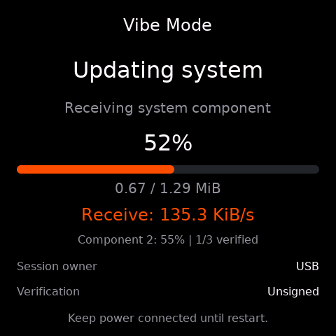

# ESP-61 实现与验证记录

验证日期：2026-09-22，Utilities 功能实现提交 `e60cb66`（rebase 前为 `08f5f1b`）。
实现包括 Download Ideas 二维码、完整网址、长配对码适配，
以及 OTA 当前状态、传输速率、整包和分组件进度。

## 已实现

- 首页和下载页统一使用 `mosaico-ideas.espressif.com`。185×185 静态二维码包含
  `https://mosaico-ideas.espressif.com/`，带四模块白边，不增加设备端 QR 编码库。
- 常规配对码使用 40px；最长 15 字节的 ASCII 码完整显示，必要时复用 24px 字体。
  保留后台预取、返回复用、Cancel 异步停止及可见页面内过期续期的现有逻辑。
- OTA 显示阶段、已传输/总容量、百分比与约一秒窗口的有效负载速率。
  Bridge/USB/TCP/NAND 对应 Download/Receive/Receive/Read 标签。
- 系统更新按整包有效字节数计算主进度，另列组件 ID、组件百分比和校验数量。
  任务或组件切换、计数回退会重置速率；停滞显示零，非传输阶段显示 `--`。
  未知总大小显示 `--`，失败页保留传输百分比。接收 100% 不等于更新成功。
- 统计字段仅扩展 Recovery 本地快照，不改变 ESP-Iris 线协议、Recovery ABI 或固定槽。

下图分别为同源原生模拟器下载页与真机 USB 系统更新画面：

## 主机与构建验证

使用 ESP-GSP 1.4.0 / gspc 0.5.0，Recovery 和 PC backend 共用控制器与场景。

| 检查 | 结果 |
| --- | --- |
| 原生 UI 输入与渲染 | 12 个场景通过；新增测试从实际截图解码二维码，覆盖普通/长码/等待、组件切换、停滞、重试、新任务、未知大小及提交失败 |
| 独立速率采样 C 测试 | 通过；覆盖不规则采样、重复时间、时钟回退、来源/任务/组件切换、计数回退及 64 位进度 |
| Bridge worker/backend/control | 3 项通过，启用 ASan/UBSan；检查整包统计及拒绝重复写入时不重复累计字节 |
| 字体、资源打包、产品契约、版本、Bridge 默认配置 | 5 项通过 |
| Recovery 构建 | ESP-IDF 6.2-dev `7b9cc1ac79f8`、Python 3.12.3、ESP32-S31，构建及固定槽检查通过 |
| Hello World 构建 | 同一 IDF 环境，构建通过，无警告 |

Recovery `factory.bin` 为 **1,812,688 字节**，固定槽 1,835,008 字节，
剩余 **22,320 字节**。相较仅完成 BSS 数组优化的 1,810,064 字节增加 2,624 字节；
仍比优化前源码基线小 19,904 字节。Recovery 构建保留一项空间余量警告。

## 已完成的真机回路

固定 Device ID：`4553502d49524953010030eda0f4518e`，硬件 v1.2，USB Highspeed。
通过工作区 `mosaico.py` 和项目 Gateway 执行写入及验证，未使用另一台 ROM 模式设备。
初始设备留有旧失败状态和 core dump；首次自更新前产品工具自动保存了 core dump，
未将其当成本次变更产生的故障。

| 操作 | Boot ID 与结果 |
| --- | --- |
| Recovery 自更新 | `4206326526575172203` → `6123387197345837199`；新 Recovery ELF SHA-256 与构建一致，HEALTHY |
| USB 系统更新 | Recovery → Hello World，Boot ID `5719236912961588250`；三个组件全部写入、校验、提交，目标应用健康 |
| USB 普通 OTA | normal `5719236912961588250` → Recovery `52331897880165680` → normal `10042825046923618859`；固件哈希及健康状态通过 |
| 下载页 | 真机截图独立解码得到完整目标 URL；真实 Bridge 注册取得配对码，返回再进入复用原码，Cancel 异步停止，重开取得有效码 |
| Gateway 工作台 | 页面所示 Device ID、Boot ID 与同一 Gateway 实时状态一致；操作记录留存于该项目 Gateway |

目标 Recovery ELF SHA-256：
`2bbea706db4907b3fd3939340eaa646f87f56d7b98da86503fd5a7521bc520e5`。
USB 测试目标 Hello World ELF SHA-256：
`86628a6925d30097e4958fb2b4eddafcf3f409733ccdd770d4a4f45c31602a8f`。

设备已有应用布局，与 Recovery 工程默认表不同。专用自更新包使用实时 inventory
返回的 `4f8786d12001684a3c02385f31ef167247827bd73b744801494a8c5851bc7231`
作为布局前置条件，包内仅有 Recovery；自更新前后分区表与 bootloader 哈希一致。
后续 Hello World 系统包的目标表也与设备现有表一致。

连续真机画面记录了 USB 系统更新约 135 KiB/s、普通 OTA 约 64 KiB/s 的接收速率。
系统更新中整包进度持续推进，切换第三个组件时整包没有退回零，短组件首次采样显示
`--`。这些是对应采样窗口的实测值，不能作为设备吞吐量上限。

## 尚待完成

- 网站可正常打开并进入 Hello World 在线烧录页，配对前出现 Cloudflare 人机验证。
  仍需操作者完成验证并触发下载。Bridge 的实际
  HTTPS 下载、提交及应用重启尚不能标记通过。
- TCP 与 NAND 的真机传输、受控网络中断重试尚未验证；主机已覆盖对应数据和状态
  边界，不替代硬件证据。本次 Gateway 的文件卷/目录接口返回 HTTP 501，未通过
  此路径传入 NAND 测试包。未执行真机断电测试。
- 预置 Recovery 包保持原评审版本，待剩余设备验收完成后整体更新。

## Rebase 与二级 bootloader 日志恢复

主仓库基于本次 fetch 的 `upstream/main` `e038e59`；Utilities 已 rebase 到
`origin/main` `7d37e97`，原有功能及 BSS 优化保留，日志与 Logo 优化提交为
`8bebd4b`。ROM 恢复中发现的枚举字段问题另由 `79878af` 修复：执行器现在读取
实际的 `device_path`，避免 `recover` 在探测阶段抛出 `KeyError: device`。

此前 `CONFIG_BOOTLOADER_LOG_LEVEL_NONE=y` 确实关闭了二级 bootloader 日志。
现已改为 INFO，保留 UART0 / 115200 文本输出，包括启动、分区选择和 Logo 信息。
早期日志发生在 ESP-Iris 启动前，不会出现在 `iris logs` 的日志环中；本次未采集
独立 UART 的启动日志，已核对生效配置、镜像日志字符串及真机镜像哈希。

Logo 字模只有 49 字节。主要优化是用固定 TX-only SPI LL 配置替换通用 SPI HAL、
直接读取 ESP32-S31 USER_DATA 的板型字段（保留虚拟 eFuse API），以及压缩单字节
初始化指令表。INFO bootloader 从 **26,720 → 24,432 字节**，节省 **2,288 字节**，
在 24,576 字节固定窗口内剩余 **144 字节**。Recovery 主镜像仍为 **1,812,688 字节**。

- Logo 主机测试：3 组 ASan/UBSan 测试通过，优化前后完整 SPI 线模式、CS、命令和
  RGB565 数据流哈希一致；覆盖 TE 开关、虚拟 eFuse、v1.0/v1.1/v1.2、未知板型、
  USER_DATA 高位不影响板型、不同绘制阶段超时、马达关闭与交接标记清理。
- ROM 执行器：22 项测试通过，包括真实枚举格式、重枚举端口及身份不匹配不写入。
  测试保留一条异步 mock 未等待警告。
- 增量构建和 `recover --source current` 独立源码构建均通过容量与镜像检查。
- 操作者进入 ROM 后，经产品命令核验 MAC `30:ed:a0:f4:51:8e` 并写入完整源码包。
  Recovery 成功返回同一 Device ID，Boot ID `4039641124994983801`。
  操作者确认“Logo 和切换均正常”。
- Hello World 系统更新及后续普通 OTA 均成功。后者验证完整
  normal `13744842544974170329` → Recovery `11642428198902441303` →
  normal `7430216119305011171`，目标 ELF 匹配且 HEALTHY；最终截图正常。
  Gateway Web 设备信息面板的 Device ID、Boot ID 与 CLI 验证结果一致。

设备读回的完整 bootloader 槽 SHA-256 与安装镜像补齐至 24 KiB 后一致：
`d46d0987d7c39faa035ac78537e93d8b0d37ad3f3455cc428fe70d97a217a054`。
本轮原始证据在 `.agents/analysis/esp-61-bootloader-logs/`；完整恢复操作
`4aa7a6c5-94b0-44fa-96d5-7f3a0a686b90`，系统更新
`db631ff4-713a-433c-b420-1107c4ca4fd6`，普通 OTA
`7eedc933-f015-40a0-aa26-bd73745a4082`。设备最终保留在健康的 Hello World；
仓库预置包仍保持原评审版本。

## 证据位置

完整原始日志、结构化命令结果与连续截图存于本工作区的
`.agents/analysis/esp-61-e2e/`；产品命令原始日志位于 `.codex-runs/mosaico/`。
Recovery 构建日志为 Recovery 工程下
`.codex-runs/idf-low-noise-build/20260922-104925-build-2754999/raw.log`。

关键 Gateway 操作 ID：

- Recovery 自更新：`2dbd7bc1-351f-40de-9507-a8244a6ae5df`
- USB 系统更新：`0b9afce7-7924-40fb-b1ab-f89c4d9fb76b`
- USB 普通 OTA：`0675470e-e691-4830-a45e-38c5ff97c416`

本记录中保留的截图已随文档纳入版本控制；原始设备与浏览器会话证据留在本地。
