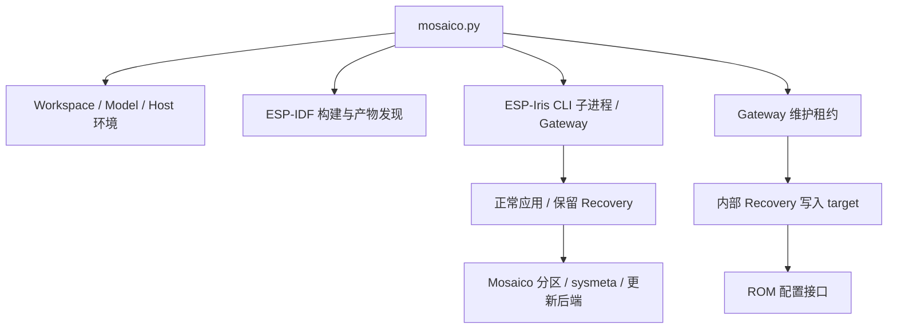

# esp-mosaico-tools 作为 ESP32 默认开发流程编排层的评估

评估日期：2026-09-05。建议先阅读：[ESP-Iris 评估](esp-iris-review.zh-CN.md)。

## 1. 结论

esp-mosaico-tools 已建立清晰的产品入口：构建应用、发现设备、维护 Gateway、申请维护租约、配置保留 Recovery、安装普通应用并等待验证。这些能力值得保留。当前实现仍明显面向 ESP-Mosaico、ESP32-S31 和固定 Flash 布局；推广为 ESP32 通用默认流程时，需要把通用编排、板级策略和发布安全策略拆开。

优先问题是：系统更新接受未签名计划且原位改写启动链；普通安装的 Recovery 切换在 OTA operation 之外；Recovery 验证只比对版本与能力，未绑定评审镜像摘要；`--validation` 被忽略；结果未知在不同代码分支有不同错误类别；HTTP/NAND 更新只有启动确认。测试还暴露了 Windows 平台假设。

目标应是：**用户使用同一个入口完成构建、安装、观察、诊断、恢复；底层根据设备状态选择 Iris、保留 Recovery、ROM 和 JTAG 适配器，所有步骤关联同一可查询操作及证据。** 本报告提出的是改进设计，没有执行这些新接口，也没有修改现有分区或设备固件。

## 2. 评估范围与基线

| 项目 | 基线 |
| --- | --- |
| 主仓库 | `1b31669e888ca563e33f05c4f652c838ddce719c` |
| esp-mosaico-tools | `3ab3f7ff44b902e9c3b0d70409f364351dc6cf7b` |
| 嵌套 ESP-Iris | `b484e47df74b105713cdec466c7622cd664a2c77` |
| 主机 | Windows；Python 3.8.7 |
| 检查对象 | `tools/mosaico_cli/`、`firmware/recovery/`、unittest、Gateway/宿主 Recovery 组件接口 |
| 评审包 | manifest schema 2；target `esp32s31`；版本 `2.3.0-recovery` |

**复现**指调用原函数或 mock/临时数据验证；**源码确认**指所列控制流可以确定；**待验证/优化**不代表已发生现场事故。P0 是进入相应推广场景前的门槛，P1 是优先修复，P2 是后续优化。

本次未运行 ESP-IDF 构建、设备烧录、Gateway 设备操作或 HIL，没有将历史 Device ID/Boot ID 当作实时证据。初始存在的 `mosaico-windows-fixes.patch` 未应用、未修改。两个子模块产品源码保持原样。

## 3. 架构现状与职责划分

应保留的已有保护包括：普通应用仅走 Iris OTA；写入前比对设备实际 partition-table SHA；多设备时要求明确选择；共享 Gateway 不被随意停止；Recovery 写入前准备全部产物；维护租约使 Gateway 释放物理端点并保存可取得的崩溃证据；完成后检查同设备、新 Boot ID 与 Recovery 服务。

未来通用层负责操作状态机、选择设备、产物、租约和证据；Board Profile 负责 ROM/USB/JTAG 路径和 Flash 策略；Mosaico 产品包保留 UI、NAND、Wi-Fi 与特定布局。通用层不应自行决定原始 Flash 地址。

## 4. 架构问题

### MOS-A01 · P1 · Model registry 尚不足以支撑多芯片、多布局

**源码确认。** [registry.py](../submodule/esp-mosaico-tools/tools/mosaico_cli/registry.py) 主要记录 target、默认型号和 recovery USB IDs；workspace 的 Recovery 路径解析到 tools 自带固件。`install` 使用 `select_model(workspace, None)`，未依据所选实时设备建立完整型号/布局绑定。[commands.py](../submodule/esp-mosaico-tools/tools/mosaico_cli/commands.py) L335–340。

固件使用固定 ESP32-S31 chip ID、地址和 Mosaico BSP；主机 `system-update-bundle` 也假定项目提供特定构建 target。仅在 registry 增加芯片名字不能完成适配。

**方向。** 引入版本化 Board Profile：chip/board、容量、运行时链路、ROM 指纹、JTAG adapter、Recovery bundle、分区策略、健康验收和受保护范围。将 profile 与实际设备 inventory、固件 manifest 三方比对；项目构建 target 也应声明能力。

**验收。** 两种不同 SoC、容量的板卡共用主机核心；错误 profile/固件/设备组合在切换状态和写入前拒绝。无网络或原生 USB 的设备有明确入口或 unsupported 结果。

### MOS-A02 · P1 · Recovery 仍依赖应用 NVS 和 UI 初始化成功

**源码确认。** [Recovery main.c](../submodule/esp-mosaico-tools/firmware/recovery/main/main.c) L20 起先 `ESP_ERROR_CHECK(nvs_flash_init())`，然后初始化 sysmeta 和 Iris；USB 启动后又对 `factory_ui_start()`、screen mirror 注册使用 `ESP_ERROR_CHECK`。

**影响。** 应用 NVS 损坏可能在维修链路启动前触发 abort；UI 初始化失败可能在维修链路刚启动后触发重启。源码已将网络失败降级为 USB 继续运行，NAND 挂载失败也有非格式化降级，但未覆盖所有非核心依赖。

**方向。** 区分身份/系统元数据与可选应用 NVS、UI、网络、文件系统。可选组件失败只暴露诊断状态。sysmeta 无法使用时设计受限维护模式，保持“不自动擦除身份与凭据”的约束。提供不依赖屏幕、NAND 和 PSRAM 的最小 Recovery profile。

**验收。** 应用 NVS 异常、屏幕不存在、I²C 超时、NAND 未挂载和无网络时仍可查询维修服务；sysmeta 异常不能静默变成新 Device ID 或整片擦除。

### MOS-A03 · P1 · 一次 install 被拆成多个操作与状态切换窗口

**源码确认。** `install` 在 `run_ota` 前，通过独立 factory RPC 和轮询进入 Recovery，随后做 live Recovery/布局验证，再创建 OTA operation。[commands.py](../submodule/esp-mosaico-tools/tools/mosaico_cli/commands.py) L371–450；[gateway.py](../submodule/esp-mosaico-tools/tools/mosaico_cli/gateway.py) L427–472。

**影响。** 没有一个操作覆盖“原应用 → 保存证据 → Recovery → 传输 → 新应用”。切换与安装之间可能插入其他客户端请求，CLI 退出也可能留下难以归属的 Recovery 状态。普通 OTA 和 factory-recovery 未自动调用 Core Dump 保存，见 IRIS-I04。

**方向。** 将整个安装流程交给 Gateway 的同一设备锁和 operation；tools 负责构建、提交、显示和等待。Recovery ABI、布局与证据保存成为 operation 阶段。ROM 写入仍由产品命令管理维护租约。

**验收。** CLI/工作台看到相同 operation ID、Boot ID、证据和阶段结果；任意步骤退出 CLI 或并发提交，不能产生未归属的重复写入。

## 5. 更新、安全与恢复协议问题

### MOS-P01 · P0（生产/分发）· 系统更新后端只接受 unsigned 计划

**源码确认。** [factory_system_update.c](../submodule/esp-mosaico-tools/firmware/recovery/main/factory_system_update.c) L529 拒绝 manifest signature 字段，L623 拒绝非零 signature_size，L640 明确接受 unsigned plan。组件 SHA、布局、范围、格式和读回校验已有实现，但没有发布者认证。

**边界。** Iris v1 允许产品后端决定是否强制签名，Gateway loader 支持 signed/unsigned。这是当前 Mosaico 产品策略不适合作为生产默认值，不是声称违反现有 unsigned 协议。HTTPS 校验服务器不能替代设备验证固件发布者。

**方向。** 加入设备端 release-key 验证、key ID、撤销/轮换、产品硬件约束与防降级；开发 unsigned profile 显式隔离。不能只开启 Gateway trust key：当前设备端反而拒绝 signed plan，必须一起升级。Secure Boot、Flash Encryption、eFuse 状态进入写入前检查。

**验收。** 未签名、错误 key、旧安全版本、跨产品计划和篡改组件在擦写前由设备拒绝；USB、HTTP(S)、NAND 采用一致策略。

### MOS-P02 · P0（可靠更新承诺）· atomic bundle 不等于断电原子更新

**源码确认。** [README](../submodule/esp-mosaico-tools/README.md) 和 commands.py 使用 atomic bundle 描述；但 [factory_system_update.c](../submodule/esp-mosaico-tools/firmware/recovery/main/factory_system_update.c) L1025–1055 临时关闭危险写保护、擦除并原位写启动组件，L1102 明确接受 single-copy commit。提交顺序为 bootloader、partition table、选择应用、持久化结果。

**影响。** 完整性验证和读回不能消除启动组件写入时断电导致的启动链损坏。`persist_result` 到 L1146 才写入，也不能证明之前掉电的提交阶段。ESP-IDF 将 bootloader/partition table 等更新列为非安全更新，与双 OTA 槽应用更新区分。[官方 OTA 说明](https://docs.espressif.com/projects/esp-idf/en/stable/esp32/api-reference/system/ota.html)

**方向。** 将外部承诺精确写成“统一计划、完整性校验、分阶段提交”；日常安装继续限定应用更新。启动链更新使用单独受控能力。如要求断电可恢复，应设计硬件支持的恢复 bootloader、冗余启动链或其它经评审方案。仅增加事务日志不能修复已损坏的第一条可执行启动路径。

**验收。** 在每个擦除、写入、验证、metadata 提交边界断电，记录可启动旧应用、新应用、Recovery 或仅剩 ROM 的结果，按结果给 profile 分类。此架构变更仅为建议，本次未实施。

### MOS-P03 · P1 · Recovery + 单应用槽不提供旧业务固件回滚

**源码确认。** [partitions.csv](../submodule/esp-mosaico-tools/firmware/recovery/partitions.csv) 只有 factory 和 ota_0，没有第二业务 OTA 槽。Recovery 写入 ota_0 时会覆盖旧业务镜像。

**影响。** 可以保留维修入口，却不能据此承诺恢复旧业务版本。该方案换取较大单应用空间，适合当前开发场景；对更新失败后仍须提供业务的产品，不等价于 A/B。

**方向。** Profile 分别声明“维修入口”“旧业务回退”“启动链断电恢复”。容量和业务需要时另行设计 Recovery + A/B；沿用当前表的产品说明降级后的业务状态。启用 anti-rollback 前还需核对 factory Recovery 与目标芯片安全方案的兼容性。[官方 anti-rollback 限制](https://docs.espressif.com/projects/esp-idf/en/stable/esp32/api-reference/system/ota.html#anti-rollback)

**验收。** 新应用不健康时以产品行为验证回退；明确记录回到 Recovery 还是上一业务版本，并检测身份和数据保留。

### MOS-P04 · P1 · Recovery 评审身份未绑定实际运行镜像

**复现。** [recovery.py](../submodule/esp-mosaico-tools/tools/mosaico_cli/recovery.py) L108–121 对 live Recovery 只检查 role、OTA capability、app_version。输入相同版本和能力、不同 firmware_sha256，原函数仍返回 verified=true。主机记录也只绑定 Device ID 和 Recovery version。

Gateway maintenance 完成检查 endpoint/Device ID、新 Boot ID、mode/version/capability，同样没有核对评审 Recovery 的摘要。[Gateway gateway.py](../submodule/esp-mosaico-tools/submodule/esp-iris/components/esp_iris/tools/iris_gateway/gateway.py) L603–640。

**边界。** 本地 load_bundle 校验文件 SHA，prepare_recovery 校验布局及安全配置。缺口在“包经过校验”到“当前运行的正是该包”之间。install 会进入 Recovery 做实时检查，不能说完全依赖缓存；实时检查仍不够强。

**方向。** Bundle 记录 BIN SHA、对应 ELF SHA、Recovery ABI、布局和构建 revision，按当前 boot 的 identity/inventory 校验。Iris 的运行固件 identity 使用 ELF SHA 语义，不能直接与 factory.bin 文件 SHA 比较；缓存只作线索。

**验收。** 同版本不同代码、不同配置 Recovery、被替换的 bootloader 和旧布局不能通过同一评审身份验证。

### MOS-P05 · P1 · HTTP/NAND 更新缺少统一完成记录

**源码确认。** [commands.py](../submodule/esp-mosaico-tools/tools/mosaico_cli/commands.py) L283–317 用 RPC 0x1201/1 或 /2 启动任务，返回 status=accepted；没有等待应用健康、实际 inventory 或最终结果。读取的 --timeout 未用于这些来源的完整生命周期。

**边界。** accepted 是诚实描述，不能说被误报为 succeeded；问题在于同名 system-update 的不同来源没有一致的追踪和验收。

**方向。** 设备返回持久 operation ID、manifest 摘要和可查询状态；Gateway 建立代理 operation，观察提交、新 Boot ID、实际布局/镜像及产品健康。统一等待和查询模式。NAND bundle 还应提供不可变目录、快照或读锁，不仅要求用户不要同时改文件。

**验收。** HTTP 断流、NAND 文件变化、设备重启、CLI 退出后，都可按同 ID 区分 accepted/running/succeeded/failed/outcome_unknown。

## 6. 主机实现问题

### MOS-I01 · P1 · --validation 被接受并报告，却没有传给 Gateway

**源码确认。** [cli.py](../submodule/esp-mosaico-tools/tools/mosaico_cli/cli.py) L130–133 提供 elf-sha256 和 version；[gateway.py](../submodule/esp-mosaico-tools/tools/mosaico_cli/gateway.py) L813 执行 `del validation`，没有传递下层已有的 --validation-mode。install 又将用户输入写进输出。

**影响。** 选择 version 后实际仍执行默认 ELF SHA 校验，CLI 报告与行为不一致。这不是绕过校验，实际可能更严格，但用户和自动化无法按选项预测结果。

**修复与验收。** 显式映射 `elf-sha256 → elf_sha256` 并传递，从 operation 实际 validation 字段构造输出；不支持的选项就删除或拒绝。对两种模式做 CLI → Gateway 参数契约测试，不能只测 argparse。

### MOS-I02 · P1 · 不同阶段的 outcome_unknown 错误类别不一致

**复现。** [_wait_gateway_operation](../submodule/esp-mosaico-tools/tools/mosaico_cli/gateway.py) 在提交结果直接 unknown 时抛 OutcomeUnknownError；若先 running、轮询后 outcome_unknown，则 L783–795 抛普通 OperationError。原函数 mock 验证得到这两种异常。

**影响。** JSON 分别输出 outcome_unknown 和 operation_failed，上层可能采用不同重试策略。轮询 gateway_json 遇到网络错误也会抛 DeviceError，而设备更新可能仍在继续。

**修复与验收。** 统一状态映射；提交可能成功后，失联、状态不明或中断都保留 operation ID 和可核对结果。明确失败须有设备拒绝或确定验证失败证据。覆盖提交和每次轮询的全部终态。

### MOS-I03 · P1 · 响应丢失时，上层缺少预先持久化的 operation ID

**源码确认。** tools 的 run_ota/run_system_update_bundle 启动 Iris CLI，收到 stdout 才获知 operation ID。下层在内存生成 UUID，HTTP 返回后输出，没有让 tools 预先指定并保存该 ID 的接口。[tools gateway.py](../submodule/esp-mosaico-tools/tools/mosaico_cli/gateway.py) L802–877；[Iris cli.py](../submodule/esp-mosaico-tools/submodule/esp-iris/components/esp_iris/tools/iris_gateway/cli.py) L574–632。

**影响。** Gateway 已接受而响应丢失时，tools 会正确拒绝自动重放，却不能提供可查询的原 ID。用户再运行命令又产生新 ID。“不自动重放”并未解决操作追踪缺口。

**方向与验收。** tools 提交前生成并原子保存 journal，含 operation ID、设备与产物摘要；下层接受指定 ID。重启后提供只读核对。模拟请求已接受而响应丢失，再启动仍查询原操作；与 IRIS-P05 的请求摘要冲突检测一起交付。

### MOS-I04 · P1 · 敏感调用的异常日志重新暴露命令参数

**复现。** [runtime.py](../submodule/esp-mosaico-tools/tools/mosaico_cli/runtime.py) L73–99 在正常路径隐藏 sensitive command/output，但异常路径直接 `self.note(f"process error: {error}")`。TimeoutExpired 字符串包含原始 command。用虚构 FAKE_SECRET_MARKER 模拟超时，标记进入日志。

**影响。** HTTP 更新 URL 等被设计为敏感的参数可能重新写入异常日志。本次只用合成标记，没有访问或显示真实凭据。

**修复与验收。** 敏感异常仅记录类型、阶段、超时和安全摘要；脱敏覆盖 stdout/stderr、exception、嵌套 details 和命令重建。注入启动失败、超时及非零退出，所有输出不得出现合成秘密标记。

### MOS-I05 · P2 · 环境、共享 Gateway 与长子进程的管理有扩展限制

**源码确认，部分影响待测。** [gateway.py](../submodule/esp-mosaico-tools/tools/mosaico_cli/gateway.py) 使用固定本地 8443 端口和共享 state，复用要求相同 Iris revision。它避免了意外替换共享进程，但不同 workspace pin 无法自然共存。venv 更新有 requirements fingerprint，但没有跨进程创建锁和分阶段原子切换。源码路径和 Python 主次版本隔离已经实现。

[doctor.py](../submodule/esp-mosaico-tools/tools/mosaico_cli/doctor.py) L49–66 用正则读取 IDF 字段且只比较 >=x.y.z，不能充当复杂约束解析器。[runtime.py](../submodule/esp-mosaico-tools/tools/mosaico_cli/runtime.py) 流式执行还把全部输出保留在列表及无界 Queue 中；超时/取消缺少统一子进程树管理。

**方向。** 发布稳定 Gateway API/能力兼容政策，为多 workspace 提供实例选择与受控升级。venv 使用安装锁、临时目录和完成后切换。按组件管理器语义校验 IDF；保留 Python 3.8 host 与 Python 3.10+ IDF bootstrap 的现有分离。长构建保留有界诊断尾部，完整输出流式落盘，统一回收异常进程。

**验收。** 并行冷启动、安装中断、不同 pin、端口占用、中文/空格路径、复杂 IDF 约束和子进程异常均有确定结果；主机内存不随完整日志线性增长。

## 7. 测试、健康验收和发布材料问题

### MOS-T01 · P1 · Windows unittest 当前不能全通过

在 tools 执行 `python -m unittest discover -s tests -v`，95 项中 **91 项通过、3 项失败、1 项报错**，0.453 秒。测试大量使用 mock，不能当作设备链路实测。

| 用例 | 结果 | 可确认原因 |
| --- | --- | --- |
| test_local_system_update_builds_and_submits_atomic_bundle | 失败 | Windows Path 输出反斜杠，断言写死 /iris-python |
| test_python38_runtime_hands_idf_to_a_newer_python | 失败 | 断言期待 POSIX bin/python，当前选择 Windows Scripts/python.exe |
| test_idf_wrapper_reports_bounded_cmake_diagnostic | 失败 | 日志路径断言写死 POSIX 分隔符 |
| test_idf_environment_uses_idf_python_without_a_shell | 报错 | fixture 直接把 Windows 路径拼入 JSON，反斜杠未转义；探测解析失败后被报告为 IDF Python 版本拒绝 |

这些结果首先证明测试平台假设有缺口，不能直接推断真实 Windows 烧录失败。日志、命令和探针位于 [审计材料](../.agents/iris-audit-20260905/)。Iris 的主机与前端结果见配套文档，不计入这 95 项。

**方向。** 建立 Windows/Linux/macOS 与支持 Python 矩阵；路径断言采用目标平台规则，fixture 用 json.dumps 生成响应，mock 覆盖实际解释器探测顺序。增加真实 Gateway demo/fake link 契约测试，覆盖 validation、unknown、operation ID、maintenance 及多客户端竞争。

**验收。** 同提交的支持矩阵全部通过；平台专用测试不阻断无关用例，真实运行行为和 mock 的假设一致。

### MOS-T02 · P1 · HEALTHY 默认只是延时接受，尚不是业务验收

**源码确认，归属宿主集成层。** [esp_mosaico_app_recovery Kconfig](../components/esp_mosaico_app_recovery/Kconfig) 默认自动接受、延时 3000 ms；[iris_ota_support.c](../components/esp_mosaico_app_recovery/iris_ota_support.c) L343–355 到时调用 esp_iris_mark_healthy，没有应用业务自检结果。它在宿主仓库，不是 tools 子模块的独立实现缺陷，但决定“应用健康”的含义。

**影响。** 固件启动但关键外设、文件系统或任务失败时仍可能被接受。固件身份和 Iris 连通性不能独立证明产品行为。

**方向。** 产品定义版本化健康契约，应用完成必要自检后显式确认；Gateway 保存策略 ID、自检结果和期限。开发模板可用明确标记的简化策略，生产 profile 不用纯延时替代业务检查。

**验收。** 注入外设失败、任务卡死、资源缺失及慢启动，失败应用不能误接受；按 MOS-P03 的真实能力判定回退结果。

### MOS-T03 · P1 · Recovery 发布证据和 HIL 尚未形成可重复门禁

**源码确认。** [prebuilt manifest](../submodule/esp-mosaico-tools/firmware/recovery/prebuilt/recovery/manifest.json) 有镜像 SHA、offset/size、target、布局、安全配置与 source commit，值得保留；但没有 ELF/map、完整 sdkconfig、Iris/BSP revision 和自动验收报告索引。IDF 字符串为 v6.2-dev-2221-g7b9cc1ac79f-dirt，source.dirty=false 只描述相应源码仓库，不证明整个工具链干净可复现。

tools 可见测试只有 test_cli.py/test_workspace.py，未见其独立 CI 工作流验证 Recovery C 后端、HTTP/NAND、bootloader 扩展和当前 prebuilt 的断电行为。Iris 历史 S31 HIL 不等价于 Mosaico 当前组合验证。

**方向。** Release 清单增加 component/toolchain provenance、ELF/map、sdkconfig 和验收索引；建立独立可恢复测试板夹具，通过产品命令执行 HIL，记录实时 Device ID/Boot ID、operation 和原始日志。bootloader 私有接口依赖按 IDF revision 做构建与行为回归，不能只放宽最低版本。

**验收。** 给定清单能重建或解释二进制差异；每个 prebuilt 有构建、正常往返、异常恢复及证据保存记录，至少覆盖以下矩阵。

| 测试组 | 场景 | 必须保存的结论 |
| --- | --- | --- |
| 初次配置 | 空白设备、错误型号、多 ROM 端点、端口更名 | 写入前身份/能力、保护范围、同设备重连 |
| 正常安装 | normal → Recovery → normal、错误布局、同版本不同 ELF | 全部 operation、Boot ID、镜像与产品健康 |
| 单应用槽 | ota_0 写入中断、新应用失败 | 回到 Recovery 还是旧业务固件 |
| 启动链更新 | bootloader/PT 每个边界断电 | 可用维修入口、是否仅剩 ROM |
| 三来源更新 | USB、HTTP(S)、NAND；签名/哈希/格式错误 | 一致策略、最终 receipt 与 inventory |
| 主机故障 | CLI/Gateway 崩溃、失联、磁盘满、租约过期 | 证据、端点所有权、不重放未知写入 |
| 集成故障 | NVS/UI/NAND/网络故障、无 PSRAM | 基本维修服务可达，身份凭据未自动擦除 |

破坏性 HIL 应使用专用板和故障注入条件。本次没有运行 Iris 自带会重刷布局、备份/恢复 NVS 的硬件套件，也没有绕过 mosaico.py 打开设备串口。

### MOS-T04 · P2 · 操作说明与实际命令有漂移

**源码确认。** [Recovery README](../submodule/esp-mosaico-tools/firmware/recovery/README.md) 仍写 list 只列型号、不查询连接设备；实际 [commands.py](../submodule/esp-mosaico-tools/tools/mosaico_cli/commands.py) 的 list_devices 会连接 Gateway 并取设备列表，仓库规范也要求实时发现。atomic、外部来源 accepted 与健康的含义也需统一。

**方向与验收。** 将 --help、JSON schema、示例和产品说明作为发布契约，在 CI 用 fake Gateway 执行示例；明确副作用、最终状态和查询方式，避免文档诱导重复提交仍在运行的更新。

## 8. 建议实施顺序

| 阶段 | tools 工作 | Iris 依赖 | 完成门槛 |
| --- | --- | --- | --- |
| 1：接口正确性 | I01–I04、T01、T04 | IRIS-P05/P06 | 参数、operation、unknown、脱敏契约一致并回归通过 |
| 2：正常流程闭合 | A02/A03、P04/P05、T02 | IRIS-I04、显式 role、reconciliation | 更新可查询，保存旧证据，验证新固件与业务 |
| 3：可移植 profile | A01、I05、T03 | IRIS-A01/P03 | 两类 SoC 共用核心；矩阵可重复；发布包可追溯 |
| 4：生产更新 | P01/P02/P03 | 安全通道及设备 receipt | 签名、防降级、启动安全和断电能力按 profile 验证 |

默认用户路径继续使用 `python mosaico.py list/install/recover/monitor`，后续补充统一诊断、操作查询和只读核对能力。日常操作不暴露原始 Flash 写入；空白设备、ROM 救援和 JTAG 由统一入口编排。

现有保留 Recovery 分区契约继续有效。A/B、冗余启动链和不同安全 profile 是独立架构建议，需评审与迁移，不能在修 CLI 或补测试时顺带改变。

## 本轮范围说明（2026-09-05）

用户已确认 IRIS-A01、IRIS-P01、IRIS-I04、IRIS-I05 属于设计规划，本轮不实施。本文关联这些条目的产品改进仍保留为后续工作，不能因本轮 Iris 修复而视为已完成。tools 自身 MOS 编号不在本轮修复清单中。

## 本轮修复后的边界更新（2026-09-06）

本轮对 tools 的配套改动仅涉及 IRIS-P03 的产品兼容性契约对接，以及用户新增授权的独立 USB Serial/JTAG Recovery 路由。`mosaico.py recover --recovery-port ...` 保留主设备及独立端点的维护 lease、受控完整 Recovery bundle 写入和主 Device ID/新 Boot/目标 Recovery 的回验；它不新增全 Flash 擦除，也不隐含承诺单分区 Recovery 更新。

此前 COM14 接到错误设备，相关失败不能用于目标板验收；正确目标已通过 COM8 完成 Recovery 更新与正常应用闭环。最终硬件结果见 [ESP-Iris 修复与验收报告](esp-iris-fix-acceptance.zh-CN.md)。上述对接不表示本文 MOS 编号全部或自动修复；原始基线证据继续保留。IRIS-A01、P01、I04、I05 继续属于设计规划内。
