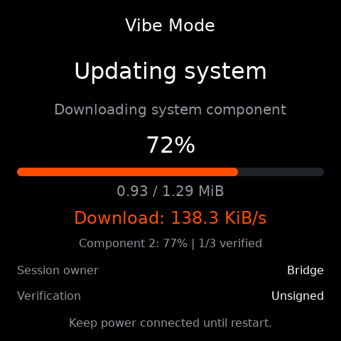

# Recovery OTA 速率与 PSRAM 优化实测

2026-09-22，Utilities 实现提交 `151a631`。在同一台 ESP-Mosaico v1.2 上，通过操作者的云端网页连续升级同一个
Hello World 包。第二轮优化的应用接收与写入平均 **130.7 KiB/s**，截图为
**131.9–138.3 KiB/s**，达到 100 KiB/s 目标；三个组件均校验、提交成功并启动健康应用。
实现与配置说明由 [Recovery README](../submodule/esp-mosaico-utils/esp-mosaico-recovery/firmware/recovery/README.md)
维护。本记录描述本次测量，不代表所有网络环境下的保证速率。

## 三轮同包对比

包中应用为 1,259,472 字节，UI 数据为 96,784 字节，分区表为 4,096 字节。
日志中的应用擦除范围 13,565,952 字节是目标分区容量，不能作为下载大小计算速率。

| 项目 | 原版本 | 第一轮：TLS 外移、异步取消查询 | 第二轮：PSRAM 与网络配置 |
| --- | ---: | ---: | ---: |
| 应用接收及写入时间 | 420.390 s | 94.668 s | 9.413 s |
| 应用阶段平均有效速率 | 2.93 KiB/s | 12.99 KiB/s | 130.67 KiB/s |
| 接受计划至完成提交 | 465.288 s | 147.071 s | 37.587 s |
| 本次启动以来片内空闲最低水位 | 12 B | 31,980 B | 116,304 B |
| 计划至提交期间 AES 分配失败日志 | 50 | 0 | 0 |
| 同一期间 TLS read error 日志 | 49 | 0 | 0 |

应用阶段统一取“application erase complete”到“verifying ota_0 readback”的
设备日志时间，包含读取、同步写入及循环开销，不含前置整分区擦除与后置读回校验。
三轮由操作者逐次触发，公网条件不受实验控制；第二轮组合修改没有逐项消融测试，
不能把全部增益单独归因于某一配置。

第二轮应用阶段内部计时：HTTP 读取累计 **774 ms**，后端写入累计 **8,446 ms**，
最长单次读取 **113 ms**。当前主要耗时已经转到同步 Flash 写入，不能拿读取计时
单独除以总字节数声称网络带宽；TCP 接收在写入期间仍可能后台进行。

第二轮应用擦除另花约 8.8 秒。取消查询曾有一次约 7.2 秒失败并退避，但没有阻塞
文件接收循环。完成提交后的 DONE 回执发生 HTTP 超时，约 17.3 秒后继续重启；
从接受计划到健康应用可见约 63 秒。因此“下载超过 100 KiB/s”不等于整个流程
只需 10 秒，擦除、校验、云端控制请求及重启仍有各自耗时。

## 原因与对应修改

1. 原版本把 TLS 动态内存放在片内，两条 HTTPS 请求与 Wi-Fi、USB、任务栈竞争。
   日志实测片内最低仅 12 字节，PSRAM 仍有约 13 MiB 空闲，并反复出现 AES
   分配失败、TLS 读取/握手失败。第一轮把 TLS 分配迁到 PSRAM，保留证书验证。
2. 下载循环每 5 秒同步访问取消查询接口。慢查询会直接停住下载，计时又从请求
   开始记录，长请求结束后容易立刻再次查询。现改为独立任务和原子取消标志，
   复用成功连接；从请求完成后等待，失败退避并遵守 `Retry-After`，退出前回收连接。
3. 第一轮仍使用 5,760 字节 TCP 接收窗口、6 项接收邮箱及 Wi-Fi 省电模式；普通
   小块分配仍偏向片内。第二轮将窗口扩大至 65,535 字节、邮箱 48 项，并配套调整
   Wi-Fi RX 缓冲与 PSRAM 分配。下载期间关闭省电，结束/失败后恢复原设置。
   Espressif 的 [Wi-Fi 性能文档](https://docs.espressif.com/projects/esp-idf/en/latest/esp32s31/api-guides/wifi-driver/wifi-performance-and-power-save.html)
   也说明 TCP 窗口和驱动缓冲是吞吐的重要约束。

## 片内内存去了哪里，哪些已迁移

优化前 ELF 中 `.dram0.data + .dram0.bss` 已占 **149,492 字节**，此外还需运行时
任务栈、Wi-Fi DMA 缓冲、TCP 数据及 TLS 堆。PSRAM 容量充足不代表这些分配会自动
使用它：原来的内部 TLS 分配策略、16 KiB 普通分配阈值和静态变量放置各自独立。

| 对象 | 本次处理 |
| --- | --- |
| 系统更新组件计划 `s_update_plan`，22,272 B | BSS 明确放入 PSRAM |
| UI 状态，4,472 B | BSS 明确放入 PSRAM，同步锁保留原位置 |
| 两份 NAND 状态快照，各 2,592 B | BSS 明确放入 PSRAM，文件系统控制对象保留 |
| ESP-Iris 日志环及元数据，4,124 B | 使用组件提供的 PSRAM 配置，日志容量仍为 4 KiB |
| Wi-Fi/lwIP 可迁移 BSS、动态网络缓冲 | 使用 SDK 的外部 BSS 与网络分配配置 |
| TLS、普通 JSON/HTTP 堆对象 | TLS 显式使用外部内存；普通分配优先 PSRAM |
| 下载缓冲 4 KiB、旧布局模式分区表 4 KiB | 从调用栈改为按需 PSRAM 分配，所有退出路径释放 |
| 取消查询任务栈 8 KiB、mDNS 栈与分配 | 使用受支持的 PSRAM 任务及分配接口 |
| Bridge 写入任务栈 | 从原 24 KiB 调整为 20 KiB，保留片内 |

链接实测片内静态数据降为 **93,404 字节**，减少 **56,088 字节（54.8 KiB）**；
外部 BSS 为 56,632 字节。两者差额还受新增诊断/任务元数据等影响，不能简单把
外部 BSS 总量当作净节省量。第二轮云端下载阶段约有 **197,199 字节（192.6 KiB）**
片内空闲，启动以来最低水位为 **116,304 字节（113.6 KiB）**，PSRAM 最低仍有约
12.5 MiB。最低水位包含启动及其他查询峰值，不是仅取下载期间的瞬时值。

最终交付增加了写入任务 4 KiB 栈余量：测速候选的 16 KiB 栈实测仅剩 868 字节，
故恢复到 20 KiB。最终固件空闲阶段实测片内空闲 194,019 字节（189.5 KiB）；
不把候选 16 KiB 栈版本的 192.6 KiB 直接标成最终固件保证值。

当前保留在片内的主要部分包括 USB CDC 端点与控制/FIFO 约 32.2 KiB、ESP-Iris
写入相关运行状态、Wi-Fi/AES 必需的 DMA 分配、RTOS 控制块、中断与 core dump 栈。
写入任务和含 NVS 操作的 UI 回调任务保留片内栈；没有全局开启任务栈外移，也没有
绕过 ESP-Iris 对 OTA writer 的栈约束。继续迁移这类任务需先把 Flash/NVS 操作
调度到专用片内栈任务。参见 [ESP32-S31 外部内存约束](https://docs.espressif.com/projects/esp-idf/en/latest/esp32s31/api-guides/external-ram.html)。

## 验证与证据

- 同一 Device ID：`4553502d49524953010030eda0f4518e`；全程通过工作区产品命令和
  Gateway 操作，连续保留设备日志与内存状态。
- 第二轮测速 Recovery Boot ID `7555841512771136369` → 健康应用 Boot ID
  `1682891013342290922`；应用 ELF 与同包目标匹配：
  `e71682afd7d25ba0692769b51257103408ab23fc2cd115917ab487374165fcd0`。
- 测速候选 ELF：`917cfa2664bc5a8bfa5a5bd49253a1147289e0a54a7a5e59015071d9ff27714c`。
  最终仅将写入任务栈增加 4 KiB，ELF 为
  `78e84733e66c5161efd53a6377939746ba35dee31372189aed4d7b36bc378103`；最终版本重新
  验证自更新、Bridge 注册和 USB 系统更新。后续操作者再次触发云端升级，15:20:50
  接受计划、15:21:52 完成提交、15:22:03 启动健康应用；应用阶段 8.964 秒，约
  137.2 KiB/s，写入任务栈余量 5,068 字节。此前 15:19 的一次重试在应用校验成功
  后报 `ESP_ERR_INVALID_STATE`，进度/取消交互的具体失败原因仍未确认。
  最终回路为 normal `1682891013342290922` → Recovery
  `13046188070088192220` → normal `17805545058636218949`，目标 ELF 匹配且健康。
  自更新操作 `4982ef7f-dc2b-423b-a347-310a41e441dd`，USB 系统更新操作
  `8fdad35d-12ca-4b29-bf17-a2ddea1c11e1`。
- Recovery 主机检查 306 项及 60 个 subtest 通过，原生 UI 12 项通过；最终栈调整后
  Bridge 三项再次通过，启用 ASan/UBSan。覆盖慢查询不阻塞文件读取、远端取消、
  连接复用、失败退避、任务创建失败、安全退出和省电模式恢复。
- 最终构建通过，`factory.bin` **1,812,880 字节**，固定槽余量 **22,128 字节**；
  bootloader **24,432 字节**，INFO/UART0 日志配置保留。构建有 2 条槽余量警告。
- 自更新未改变设备分区表与 bootloader，未覆盖凭据；旧 core dump 由产品工具
  保留，未将历史转储计为本次崩溃。预置 Recovery 包已更新为最终验收镜像，见
  [预置包来源与限制](../submodule/esp-mosaico-utils/esp-mosaico-recovery/firmware/recovery/prebuilt/recovery/README.md)。

本地原始证据：

- `.agents/analysis/esp-61-upgrade-capture/20260922-141342/`：持续日志及结构化状态。
- `.agents/analysis/esp-61-ota-optimization/`：三轮统计、ELF 内存布局、测试结果、
  自更新结果、最终 USB 回路；`cloud-psram-upgrade/` 保留连续截图与健康验证。
- `.codex-runs/idf-low-noise-build/20260922-150538-build-2884489/raw.log`：最终构建。

正式截图随本记录纳入版本控制；原始网络会话证据留在本地。
