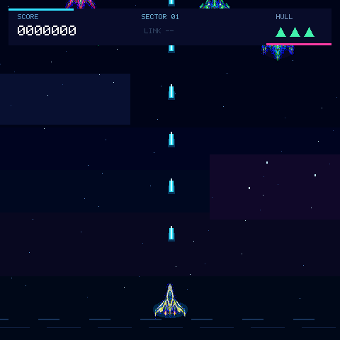

# Mosaico Strike

A vertical shooter reference app for the Mosaico Game SDK. Drawing goes through
`mosaico_raylib_fast.h` onto a 480×480 RGB565 framebuffer instead of Raylib's
generic software-OpenGL rasterizer.

纵向射击参考应用。绘制经 `mosaico_raylib_fast.h` 落到 480×480 RGB565 帧缓冲，而不是 Raylib 通用软件 OpenGL 光栅器。



## Play / 玩法

- Touch to start, then drag the ship. Firing is automatic. / 点击开始后拖动飞船，自动开火。
- Survive waves of assault, scout, and tank enemies. / 在突击、侦察和坦克敌人的波次中存活。
- Gameplay is 30 Hz with fixed enemy and bullet pools. / 玩法 30 Hz，敌人和子弹使用固定对象池。

Device and Host touch use the Mosaico extension queue. Event sound effects use
the board ES8311/I2S path because the current Raylib ESP backend disables
`raudio`.

设备和 Host 触控走 Mosaico 扩展队列。音效走板载 ES8311/I2S，因为当前 Raylib ESP 后端关闭了 `raudio`。

## Run / 运行

```bash
python mosaico.py game sim --project projects/raylib_shooter
python mosaico.py game build --project projects/raylib_shooter
python mosaico.py recover   # blank or unverified devices first
python mosaico.py iris system-update --project projects/raylib_shooter
python mosaico.py iris logs
```

Use `iris system-update` for the first install or layout/resource changes;
`iris app-update` only when the full partition table is unchanged.

首次安装或布局/资源变化用 `iris system-update`；分区表完全一致且只改代码时可用 `iris app-update`。
