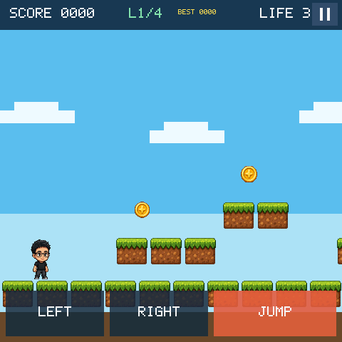

# Sky Hop

A four-level scrolling platformer for ESP-Mosaico. Progress, score, and lives
carry between levels; finishing level 4 completes the run. The Host RGB565
preview and the device compile the same gameplay model.

四关横版跳跃 Demo，用于验证 Mosaico Raylib Game SDK。关卡进度、分数和生命会带入下一关；打通第 4 关即通关。Host RGB565 预览与真机共用同一套玩法模型。



## Play / 玩法

- Tap the title card to start. / 点击标题卡开始。
- Bottom-left `<` moves left, `>` moves right, `JUMP` jumps. / 底部左侧 `<` 左移，中间 `>` 右移，右侧 `JUMP` 跳跃。
- Top-right pauses or resumes. Button, joystick, and IMU map to the same actions. / 右上角暂停/继续；按键、摇杆和 IMU 映射到同一套 Action。
- Collect coins, stomp purple patrols, and reach the right edge of each level. / 收集金币、踩掉紫色巡逻怪，抵达关卡最右侧。

Host keys: `A/D` or arrows to move, Space to jump, `P` to pause, Enter to start or advance. / 键盘：`A/D` 或方向键移动，空格跳跃，`P` 暂停，回车开始或进入下一关。

This build uses platform `Camera2D` world coordinates, scene-slide tweens, a
fixed particle pool, a pause scene, and NVS high-score storage. A read-only
embedded atlas/audio fallback is kept only when the `game_assets` partition is
missing.

本版本使用平台 `Camera2D` 世界坐标渲染，包含场景滑入 Tween、固定容量粒子、暂停场景和 NVS 最高分。仅在 `game_assets` 分区不可用时回退到只读嵌入资源。

## Run / 运行

```bash
python mosaico.py game sim --project projects/sky_hop
python mosaico.py game sim --project projects/sky_hop --headless --frames 300
python mosaico.py game build --project projects/sky_hop
python mosaico.py recover   # blank or unverified devices first
python mosaico.py iris system-update --project projects/sky_hop
python mosaico.py iris logs
```

Interactive Host preview: `http://127.0.0.1:8460/`. Use `iris system-update` for
the first install or layout/resource changes; `iris app-update` only when the
full partition table is unchanged and you are updating application code.

交互预览地址为 `http://127.0.0.1:8460/`。首次安装或布局/资源变化用 `iris system-update`；分区表完全一致且只改代码时可用 `iris app-update`。
