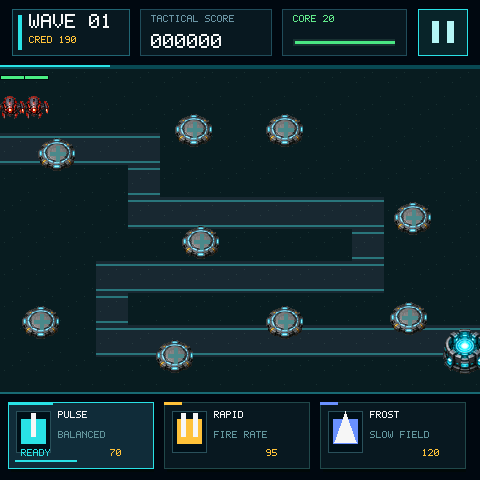

# Circuit Keep

A resource-backed tower-defense acceptance project for the Mosaico game
platform. Map data comes from Tiled `.tmj`; towers and units come from a
unified RGB565+A8 atlas. The device and Host share the same assets, game
model, and C pixel renderer.

资源化塔防验收项目。地图来自 Tiled `.tmj`，塔和单位来自统一 RGB565+A8 Atlas。设备和 Host 共用同一套资源、游戏模型和 C 像素渲染核心。



## Play / 玩法

1. Tap to start. / 点击开始。
2. Choose `PULSE`, `RAPID`, or `FROST` at the bottom. / 底部选择 `PULSE`、`RAPID` 或 `FROST`。
3. Tap a `+` pad to build. Tap a matching tower to upgrade (max 3). A different
   type rebuilds the pad at 50% credit for sunk cost. / 点 `+` 基座建塔；同类再点可升级到三级；不同类型会改造旧塔，旧投入按 50% 折抵。
4. Stop three enemy types from reaching the right-hand core. / 阻止三类敌人进入右侧核心。
5. Top-right pauses. When the core dies, tap the panel to restart. / 右上角暂停；核心生命归零后点击面板重开。

The three towers trade balanced damage, fire rate, and slow control. Object
pools are fixed; nothing is allocated during play.

三类塔分别侧重均衡伤害、射速和减速。对象池固定，运行中不分配。

## Run / 运行

```bash
python mosaico.py game sim --project projects/tower_defense --headless --frames 90
python mosaico.py game sim --project projects/tower_defense
python mosaico.py game build --project projects/tower_defense
python mosaico.py recover   # first deploy of the game_assets partition
python mosaico.py iris system-update --project projects/tower_defense
python mosaico.py iris logs
```

Interactive Host preview: `http://127.0.0.1:8460/`. Use the Gateway Web
workbench at `http://127.0.0.1:8443/` to watch the same Device ID.

交互预览：`http://127.0.0.1:8460/`。网页工作台 `http://127.0.0.1:8443/` 可观察同一 Device ID。

Use `iris system-update` for the first install or layout/resource changes;
`iris app-update` only when the full partition table is unchanged.

首次安装或布局/资源变化用 `iris system-update`；分区表完全一致且只改代码时可用 `iris app-update`。
